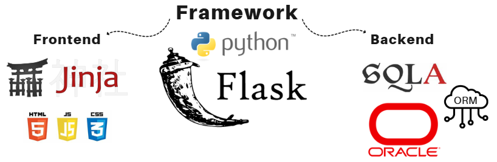

# 1. Descripción
Esta aplicación está diseñada e implementada para el *área de Explotación de Sistemas | Operaciones OSS* de la empresa **TelSur**. Permite gestionar componentes de infraestructura, sus dependencias y servicios asociados, estos almacenados en su **_CMDB_** oracle. Los usuarios pueden realizar operaciones _CRUD_ sobre los registros, facilitando el control de los datos de la infraestructura de sus servicios.

# 2. Características
La aplicación, al ser CRUD, permite la gestión de información dentro de la CMDB:
1. **__Leer__** la información de las tablas dentro de la CMDB, como lo son los Avisos y Logs de los monitoreos de los servicios así como toda la información de infraestructura.
2. **__Editar__** la información de la infraestructura.
3. **__Eliminar__** (o desactivar en el caso de los CI's) los elementos de infraestructura almacenados.
4. **__Agregar__** nuevos elementos a la base de datos. 

# 3. Instalación

# 4. Uso

# 5. Tecnologías Utilizadas
- **Framework:** Flask Python
- **Frontend:** Jinja2 | HTML, JavaScript, CSS
- **Backend:** orm SQLAlchemy, Base de Datos Oracle 



# 6. Estructura del Proyecto
```
CMDB-APP/
│
├── app/                # Carpeta principal con la lógica de la app
│   ├── __init__.py     # Inicialización de la app Flask
│   ├── routes/         # Definición de las rutas (endpoints)
│   ├── controller/     # Controladores (lógica del negocio)
│   ├── models/         # Modelos de la base de datos
│   ├── database/       # Conexión a la base de datos
│   └── views/          # Archivos de Frontend
│       ├── static/     # Archivos estáticos (CSS, JS, imágenes)
│       │   ├── CSS/
│       │   ├── images/
│       │   └── js/
│       └── templates/  # Plantillas HTML
├── docs/               # Documentación del proyecto
├── requirements.txt    # Dependencias del proyecto
├── config.py           # Configuración de la aplicación y de la base de datos
├── README.md           # Este archivo
├── LICENSE             # Licencia del proyecto
└── run.py              # Archivo principal para ejecutar la app
```

# 7. Licencia
Este proyecto está bajo la [MIT License](./LICENSE) - consulta el archivo LICENSE para más detalles.

